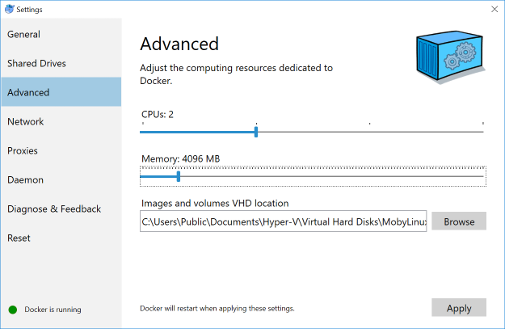

# ELK-stack-docker
This example Docker Compose configuration demonstrates many components of the
Elastic Stack, all running on a single machine under Docker.

## Starting the stack
Go to base path, then run
```
docker-compose up -d
```
To create a demonstration Elastic Stack with a search engine for books,
Elasticsearch, Kibana, Logstash, Filebeatm (and also APM Server, Auditbeat, Metricbeat,
Packetbeat, and Heartbeat, but they are commented out)

This will take approximately 5 minutes for Kibana to be setup with Logtrail,
and books to be loaded into Elasticsearch

### Front end for book searching
A demostration of how quickly NodeJS can fetch search results in real time.
Point a browser at [`http://localhost:28082`](http://localhost:28082) to see the results.


### Kibana frontend
The original ELK stack's frontend
Point a browser at [`http://localhost:5601`](http://localhost:5601) to see the results.


# Technology stack
A general description of what is used in this project. Details in [docker-compose.yml](docker-compose.yml)
| Technology | Function |
|-|-|
| Elasticsearch | Data engine using Lucene indices, backend for books and metrics |
| Kibana | Front end for Elasticsearch |
| Logtrail | Live log tailer plugin - this is integrated as part of the [init script](scripts/setup-kibana-logtrail.sh) |
| Logstash | Log enrichment and tokenizer (can be used for log scraping though Filebeat is better at the function) |
| Filebeat | Log shipper |
| NodeJS API | [Booksearch applet host](Dockerfile). Loads a preselection of 100 open community books on init |
| VueJS Frontend (NGINX) | Book search applet frontend |
| APM | (Commented out) Application performance monitoring - Expand to application metrics with Elastic APM |
| Heartbeat | (Commented out) Checks if an application is alive |
| Auditbeat | (Commented out) Linux audit framework data and monitor the integrity of files |

# Prerequisites
- Docker and Compose. Windows and Mac users get Compose installed automatically
with Docker. Linux users can:
```
pip install docker-compose
```

- At least 4GiB of RAM for the containers. Windows and Mac users _must_
configure their Docker virtual machine to have more than the default 2 GiB of
RAM:

